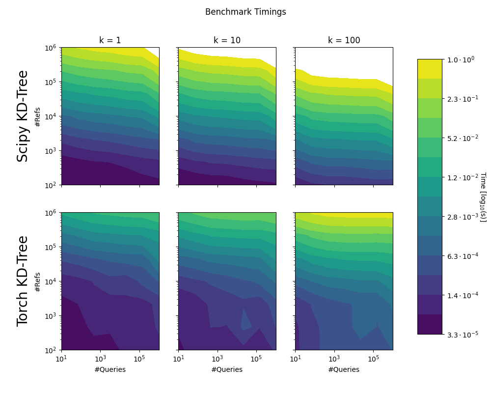

# CUDA/Tensorflow KD-Tree K-Nearest Neighbor Operator
This repository implements a KD-Tree on CUDA with an interface for [cupy](https://cupy.dev/). It is a port of a previous implementation for tensorflow called [tf_kdtree](https://github.com/thomgrand/tf_kdtree).

TODO

# Usage Examples

```python
from cupy_kdtree import build_kd_tree
import cupy as cp
from scipy.spatial import cKDTree #Reference implementation

#Dimensionality of the points and KD-Tree
d = 3

#Create some random point clouds
points_ref = np.random.uniform(size=(1000, d)).astype(np.float32) * 1e3
points_query = cp.random.uniform(size=(100, d)).astype(cp.float32) * 1e3

#Create the KD-Tree on the GPU and the reference implementation
cp_kdtree = build_kd_tree(points_ref, device='gpu')
kdtree = cKDTree(points_ref)

#Search for the 5 nearest neighbors of each point in points_query
k = 5
dists, inds = cp_kdtree.query(points_query, nr_nns_searches=k)
dists_ref, inds_ref = kdtree.query(points_query, k=k)

#Test for correctness 
#Note that the cupy_kdtree distances are squared
assert(np.all(inds.get() == inds_ref))
assert(np.allclose(cp.sqrt(dists).get(), dists_ref, atol=1e-5))
```

# Installation

Prerequisites
-------------
The library can be built for CPU only, but performs similarly with [cKDTree](https://docs.scipy.org/doc/scipy/reference/generated/scipy.spatial.cKDTree.html). Below are the requirements for the faster GPU version

- Numpy
- Cupy
- Cuda

Build Instruction
-----------------
*Under construction..*

# Tests
The library contains a small C++ example that will perform a small simple test. It is run by calling `./test_kdtree` in the build directory. For 

# Benchmark

We compared both implementations to the scipy.spatial.cKDTree. Note that the benchmarks do not consider the time to build the KD-Trees, or the transfer to the GPU. Times greater than 1 second not shown.

Test Machine Specs: Intel Core i7-5820K CPU 6x @3.30GHz, 32GB of working memory and a NVidia RTX 2080 GPU.



To run the benchmark on your computer, go to the folder scripts and execute `ipython benchmark.py`. This will create `benchmark_results.npz` that can be converted to a figure using `ipython plot_benchmark.py`.

# Acknowledgements

If this works helps you in your research, please consider acknowledging the github repository, or citing our [paper](https://arxiv.org/abs/2102.09962) from which the library originated.

```
@article{grandits_geasi_2021,
	title = {{GEASI}: {Geodesic}-based earliest activation sites identification in cardiac models},
	volume = {37},
	issn = {2040-7947},
	shorttitle = {{GEASI}},
	url = {https://onlinelibrary.wiley.com/doi/abs/10.1002/cnm.3505},
	doi = {10.1002/cnm.3505},
	language = {en},
	number = {8},
	urldate = {2021-08-12},
	journal = {International Journal for Numerical Methods in Biomedical Engineering},
	author = {Grandits, Thomas and Effland, Alexander and Pock, Thomas and Krause, Rolf and Plank, Gernot and Pezzuto, Simone},
	year = {2021},
	keywords = {eikonal equation, cardiac model personalization, earliest activation sites, Hamilton–Jacobi formulation, inverse ECG problem, topological gradient}
}

```

